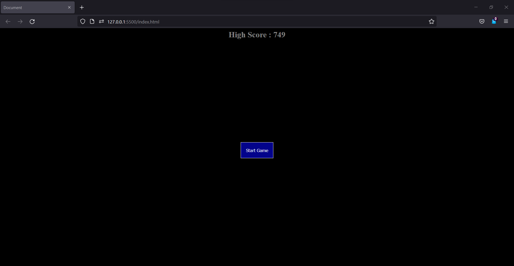
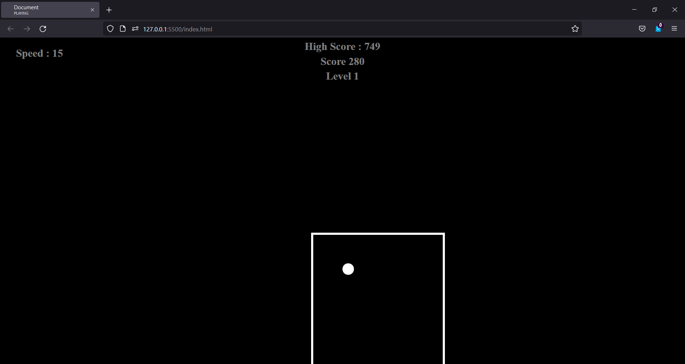
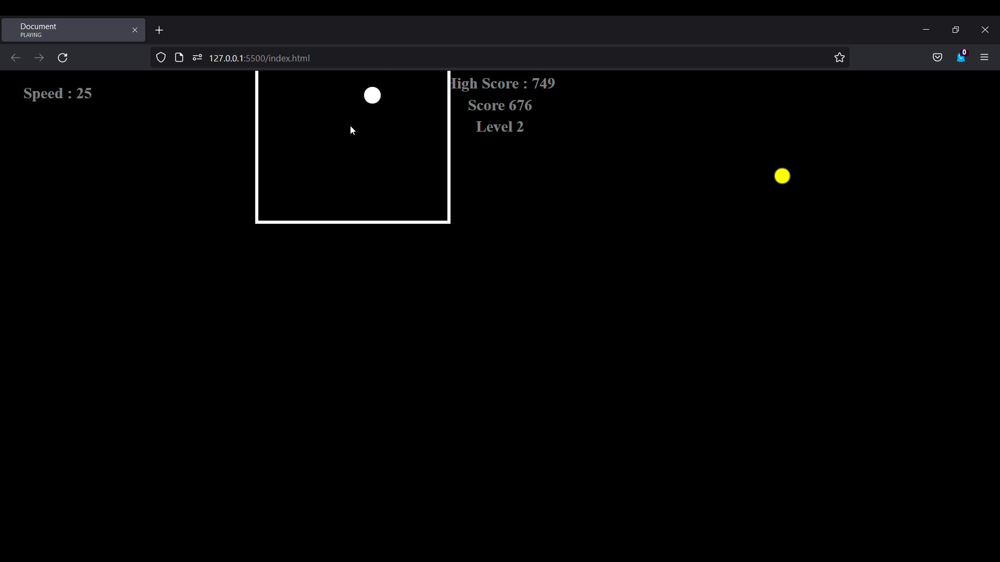

# Vanilla JavaScript game
This is the first project i made while learning javascript.

## Working
A very simple game with the objectve to keep a ball inside a square the ball moves randomly and increases its speed as you progress through the levels. Also from time to time powerups appear. There are fur different powerupsdifferentiable by their color each one provides a different ability i.e one slows down the ball, one speeds it up, one makes your square bigger, one shrinks it.
## Screenshots

You can play [here](https://sajeelhashmi.github.io/game/index.html).
